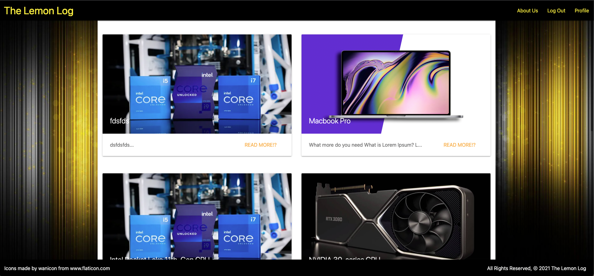
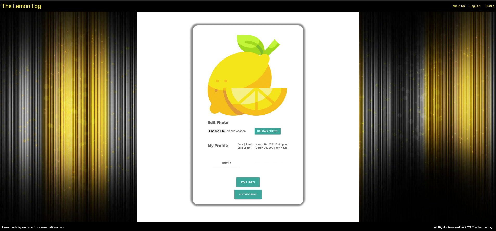
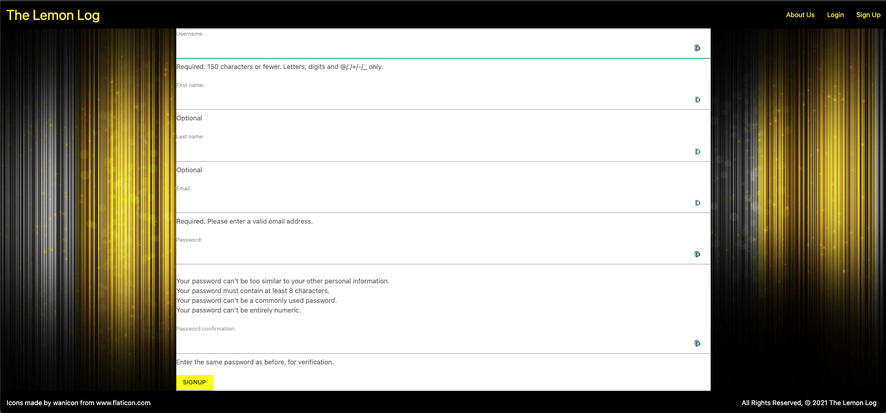
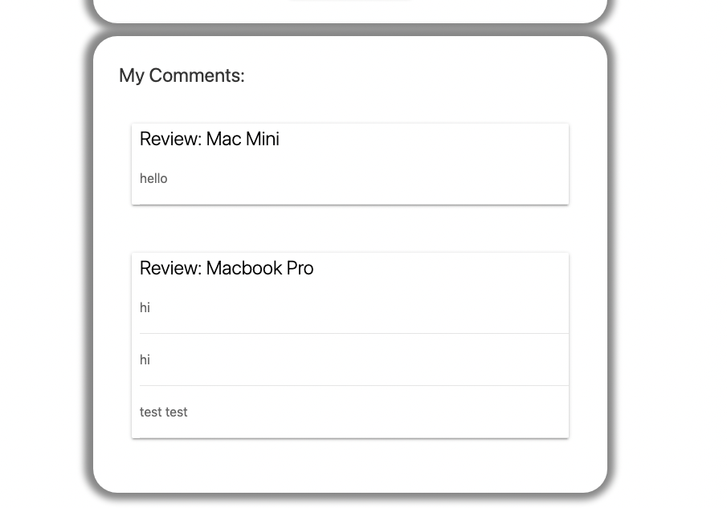
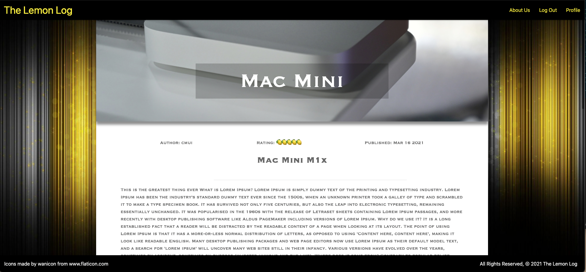
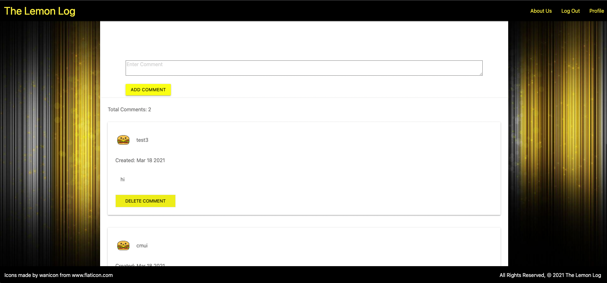
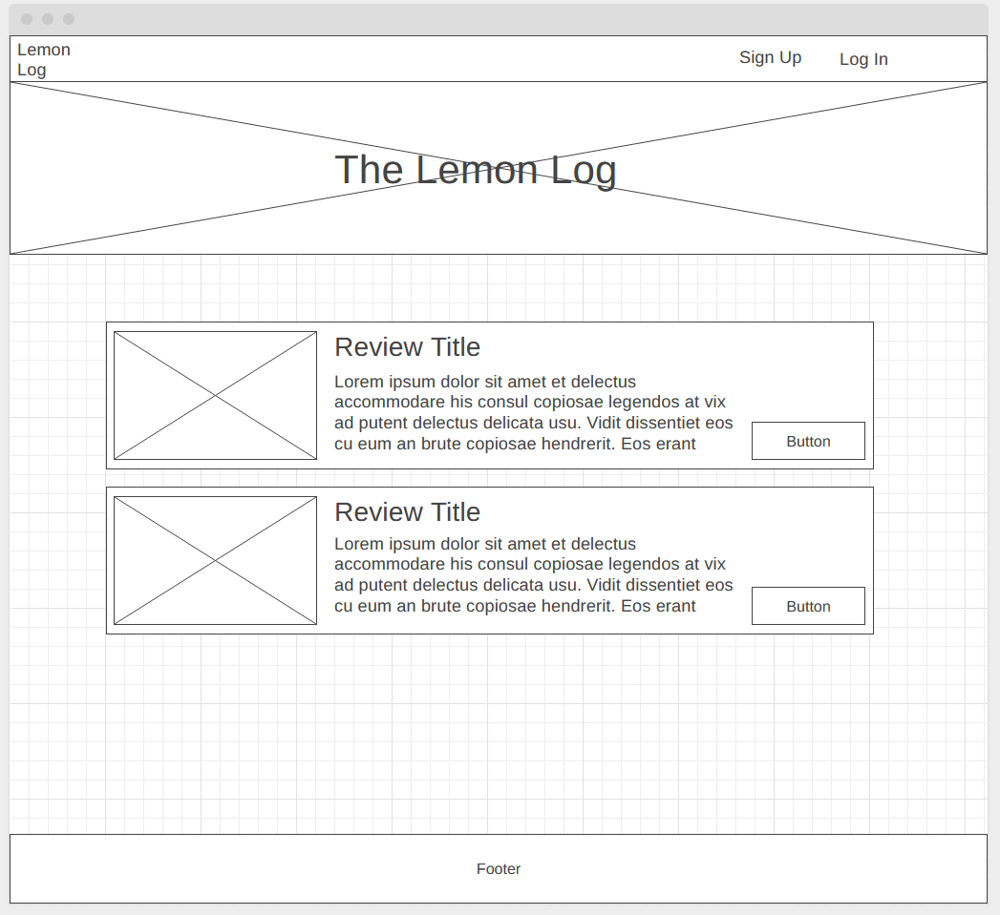
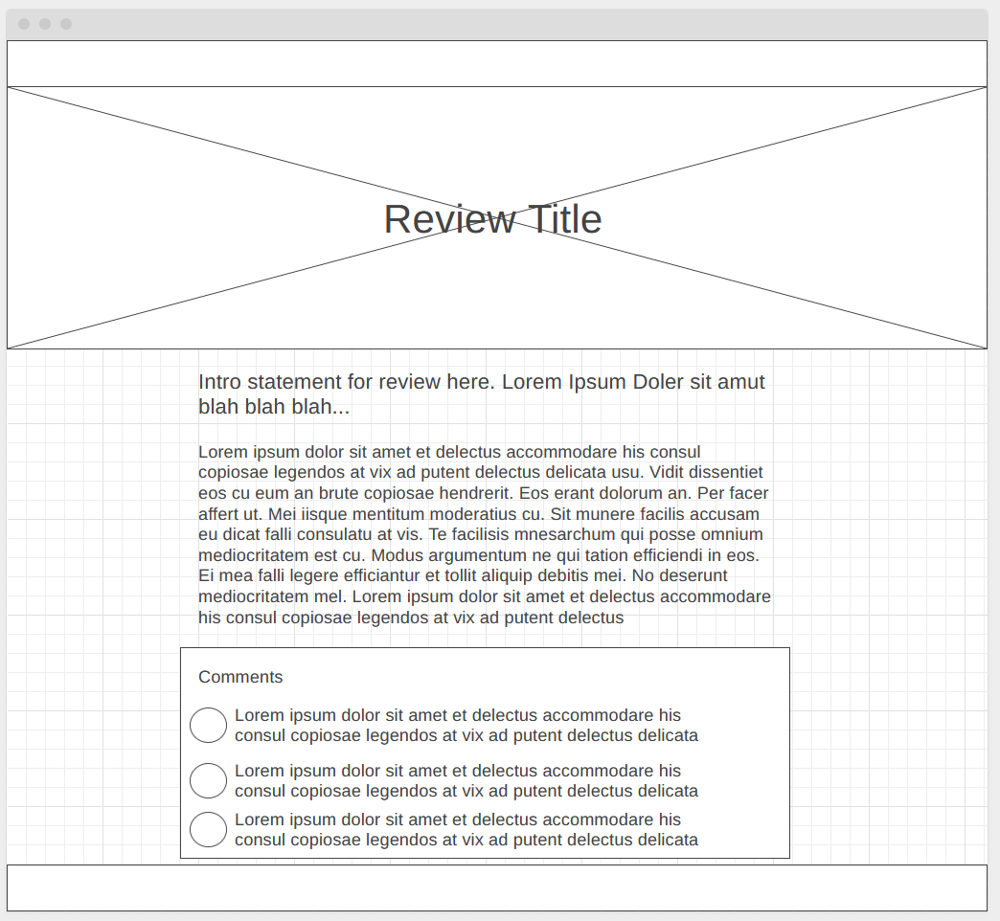
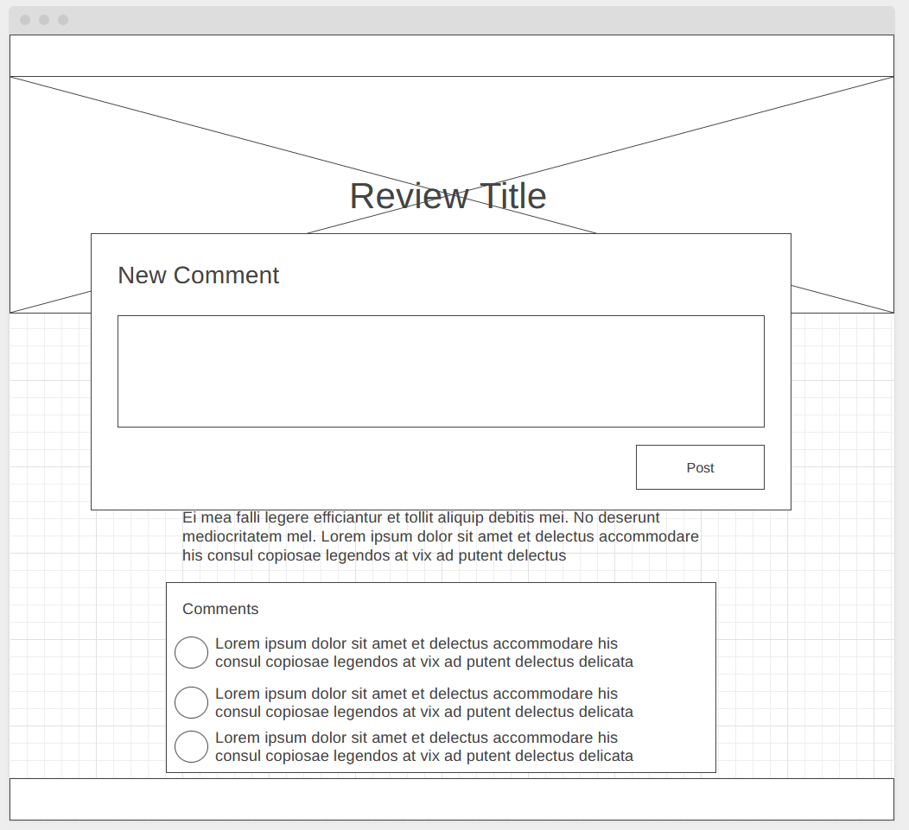
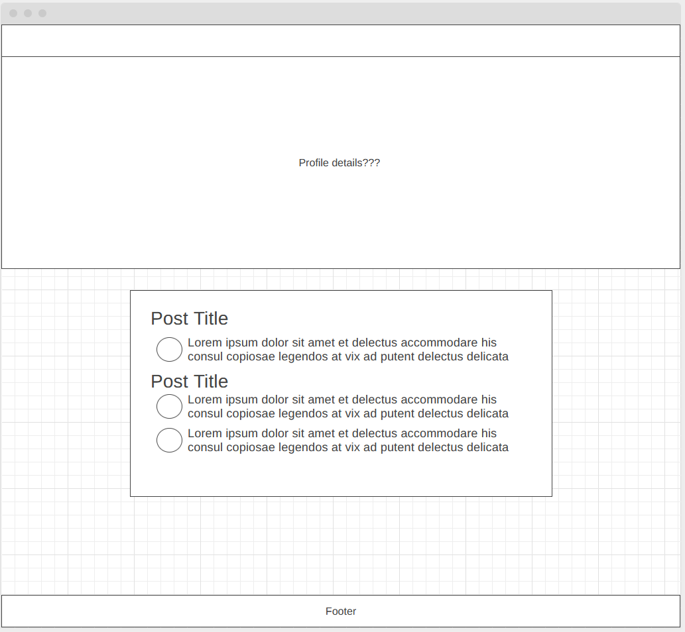

# TheLemonLog

## Link to deployed project

## Project Description
Lemon Log is a tech review site where experts post reviews of tech products. The Lemon Log Team aims to provide the most professional and succinct opinions to inform their users of what to buy and what to skip. Users can post comments on reviews to share feedback or their own experiences. 

## List of the Technologies Used
* HTML
* CSS
* Javascript
* Python
* Materialize
* UI Kit
* Django

## Installation Instructions
#### 1. Set Up virtual environment

- `python3 -m venv .env`
- `source .env/bin/activate`

#### 2. Install packages from requirements.txt
- `pip3 install -r requirements.txt`

### 3. Migrate (if it is the first time setting up the database)
- `python3 manage.py migrate`

## User Stories

### Sprint 1: Basic Auth & Profiles
A user should be able to:
* Navigate to "/" and see a basic splash page with:
    * The name of the website.
    * Links to "Log In" and "Sign Up"
* Sign up for an account.
* Log in to their account if they already have one.
* Be redirected to their public profile page after logging in.
* On their public profile page, see their name, and their join date.
* See the site-wide header on every page with:
    * A link to "Log Out" if they're logged in.
    * Links to "Log In" and "Sign Up" if they're logged out.
* Update their profile by making changes to their name.
* An admin user should be able to add a review to the site through the admin panel.
* See a default profile photo on their profile page before adding their own photo
    * Update their profile photo

### Sprint 2: CRUD

* View a single review page (at "/reviews/1") including:
    * The review title.
    * The rating of the product.
    * At least one high quality image of the product being reviewed.
* View a list of reviews on the Home page:
    * Sorted by newest first.
    * With the review titles linked to the individual review "show" pages.
* Use an "Add Comment" button on a single review page to pull up the new comment form.
* Create a new comment for a review.
* Click "Edit" on ANY individual comment, and be redirected to the edit form.
* Click "delete" on ANY individual comment, then:
    * See a pop-up that says: "Are you sure you want to delete this comment?"
    * If the user confirms, delete the comment.
* On the homepage, see review content truncated to 1000 characters max, with a link to view more

### Sprint 3: Validations & Authorization

* Verify that a new comment they create is successfully published on the correct review page.

* A user CANNOT save invalid data to the database, according to the following rules:
    * A user CANNOT sign up with an email (or username) that is already in use.
    * A comment must be between 1 and 240 characters.
    * A comment must not be empty.
* A user is authorized to perform certain actions on the site, according to the following rules:
    * A user MUST be logged in to create/update/destroy resources.
    * A user may only edit their own profile and edit/delete their own comments.
* A user should be able to see a list of review titles they've contributed comments to, on their public profile
* A user can see the number of comments on each review

### Sprint 4: Admin Users

An admin user should be able to:
* Moderate comments on an individual review
* Create, edit, and delete reviews through the website
* Admins should be able to upload and host their own image files to use in reviews on the site

## Screenshots

 

## Wireframes

## Unsolved problems/Major Hurdles
There were no significant major hurdles in this project. However, there are many design issues that have yet to be addressed. For instance, the website is not responsive, and some of the UI design requires some tweaking. We unfortunately had an issue with getting one of our modals to work with Materialize, which was the original framework we were using, so we added in UI Kit. However, we did not have enough time to go back and remove all the references to Materialize. This caused some compatibility issues and we had to do inline-styling to override and ensure that the styling was how we wanted it to be. 

On the backend side, there is one issue where we could not pass individual validation error messages to the front-end, but the website nevertheless lets the user the know that something had went wrong.

## Future Development
Front-end Design:
UI frameworks will be simplified such that we will only be using one framework, and the in-line styling will be moved into CSS files. A lot of code refactoring and organization will be necessary.
We were also given design templates for the UX designer that we were working with, but we did not have enough time to fully implement the design and had to abandon the design concepts.

Back-end and User Experience Improvements:
Validation error messages for each individual validation error should be displayed. Some of the bonus features that were listed in the sprints would improve user experience significantly.

